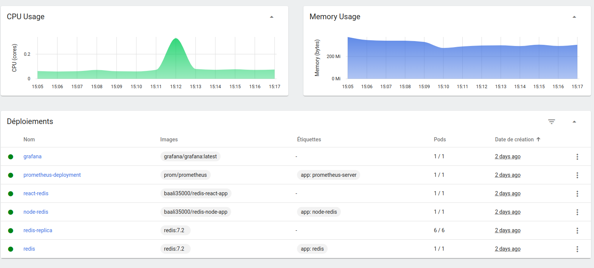
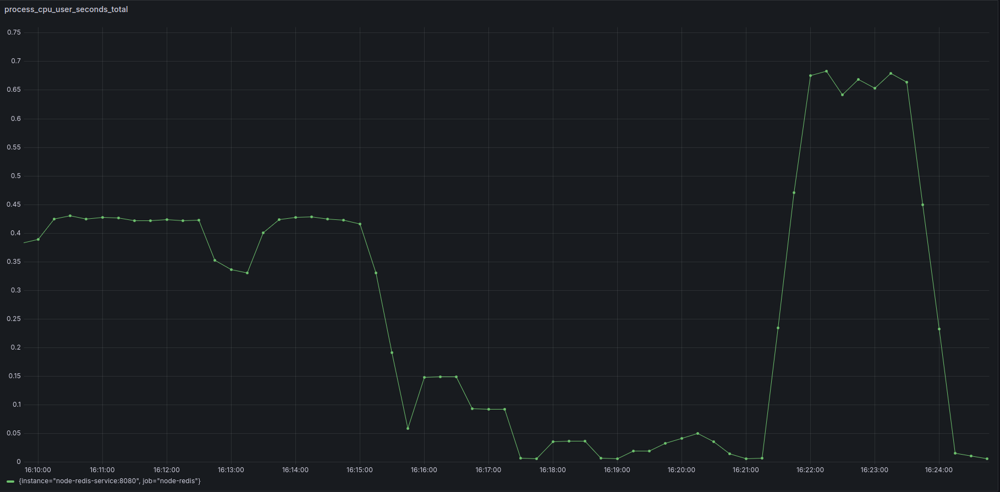
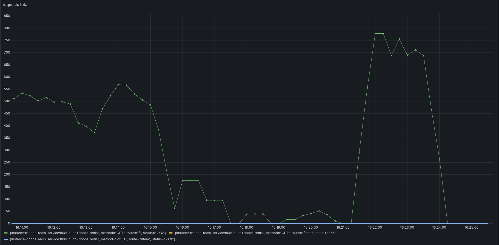
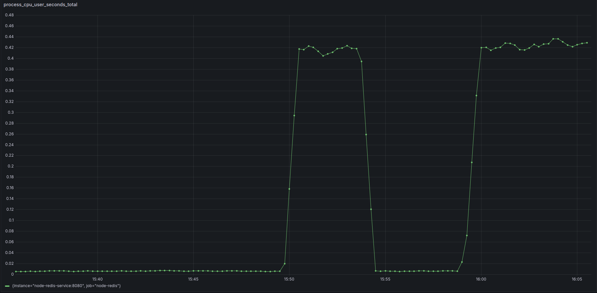
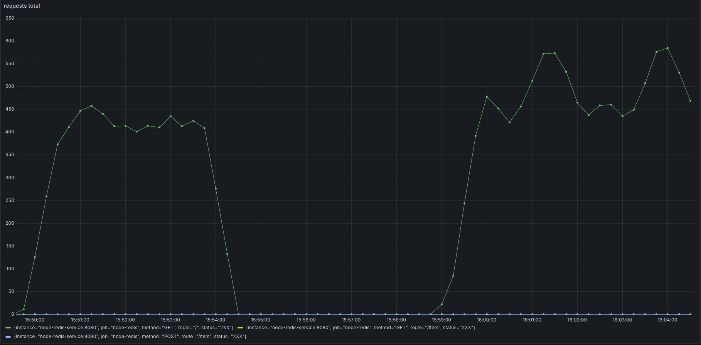

# Projet Observabilité

# Partie 1 (Créer l'infrastructure de l'application)

## 1ere étape : la base de données Redis
* On crée un déploiment pour la base principale qui accepte l'écriture et la lecture (le fichier redis_deployment)
* On crée un service pour exposer le déploiment (avec le fichier redis_service) 
* On crée un déploiment pour les bases de données replica (le fichier redis-replica-deployment) avec la mommande slave-of du premier déploiment de la base principale
* commande d'éxécusion des fichier 
    ```
    kubectl create -f "file_path"
    ```

## 2eme étape : le déploiment de l'application Redis_node
* Pour créer le déploiment de l'application on a besoin d'une image qu'on vas créer avec le fichier Dockerfile, et qu'on vas lancer avec la commande 
    ```
    docker build -t redis-node-app . 
    ```
* J'ai publié l'image sur mon docker hub pour pouvoir utiliser l'image depuis mon cluster kubernetes 
	```
    docker tag redis-node-app baali35000/redis-node-app
	docker login
	docker push baali35000/redis-node-app
    ```

* On crée le déploiment de notre application (fichier  node-redis-deployment)
On donne dans le fichier de déploiment les valeurs des variable d'environement des url des bases de données redis (principale et replicas) 
	```
    env:
            - name: PORT
              value: '8080'
            - name: REDIS_URL
              value: redis://redis.default.svc.cluster.local:6379
            - name: REDIS_REPLICAS_URL
              value: redis://redis.default.svc.cluster.local:6379
    ```
* On crée le service pour notre application ( le fichier node-redis-service)

* Pour accéder à l'application en dohr du cluster j'ai utilisé un ingress et pou faire ça il fallait : * 

    * d'abord avoir un inrgess controler, le plus simple c'est d'utilisé nginx pour l'installer :
        ```
        minikube addons enable ingress
        ```
    * après créer l'ingress avec le fichier node-redis-ingress.yml
    * je lui donné comme domaine node-redis.com 
    * donc pour que je peux acceder depuis mon localhost au domaine j'ai ajouter une ligne dans mon fichier /etc/hosts pour mapper le domaine que j'ai choisie avec l'adress de mon minikube 
    * et avec ça je peux acceder à mon application avec le dommaine node-redis.com


## 3eme étape : le déploiment de l'application Redis_react
* Pour créer le déploiment de l'application on a besoin d'une image qu'on vas créer avec le fichier Dockerfile, et qu'on vas lancer avec la commande 
    ```
    docker build -t redis-react-app . 
    ```
* J'ai publié l'image sur mon docker hub pour pouvoir utiliser l'image depuis mon cluster kubernetes 
    ```
    docker tag redis-react-app baali35000/redis-react-app
    docker login
    docker push baali35000/redis-react-app
    ```
* On crée le déploiment de notre application (fichier  react-redis-deployment)

* On crée le service pour notre application ( le fichier react-redis-service)

* pour tester si l'application marche bien, la façon la plus simple pour y accéder en dohr du clusteur c'est de faire du port forwarding du service : 
    ```
    kubectl port-forward svc/react-redis 3000:3000 
    ```

## 4eme étape : Autoscaling 
Pour l'autoscaling kubernetes offre plusieurs type d'autoscaling, celui que j'ai utilisé c'est l'HorizontalPodAutoscaler, 
qui consiste à ajouter de nouveau replica de notre app si jamais une certainne ressource dépasse un seuille donné.\
J'ai utilisé le CPU avec un seuille de 70%.\
Les deux ficheirs de config pour créer l'autoscaling sont node-redis-autoscaling.yml et react-redis-autoscaling.yml

## 5eme étape : Prometheus
* Créer la configuration avec le fichier prometheus-config:
	on définie le scrape-intervale à 15 sec par éxemple
	on vas créer un job pour monitorer l'application node-redis, pour le targeter on lui donne le nom du service et le port 
		-ex: targets:["node-redis-service:8080"] 
* Créer le déploiment (fichier prometheus-deployement)
	j'ai récupérer un deploiment par défault (on change le nom de config pour mettre la notre)

* Créer le service (fichier prometheus-service)

## 5eme étape : Grafana
* Créer le dépoiment (fichier grafana-deployment)
* Créer le service (fichier grafana-service)
* Puisque on va pas gérer du loadbalancing sur ce service, on fait juste du port forwarding pour le service de grafana pour pouvoir y accéder
    ```
    kubectl port-forward svc/grafana 3000:3000
    ```
 
* On va sur localhost:3000, sur la page de connexion de grafana par défault on se connect avec admin/admin
* On va sur les data source, on choisi prometheus, on met le nom du service avec le port et on test la connexion
```
    http://prometheus-service:9090
```
* J'ai crée un dashboard pour monitorer les différente metric qu'on veut monitorer (ex: cpu usage, memory usage, total requests, response time) 


# Partie 2 (Observabilité)
## 1er test sans limiter les ressources de conteneurs
Avec le  script :
```
node fetchData.js server 10000 100
```


L'execution etait asser rapide, on peut voir une montée sur le graph de nombre d'appel et que les appels sont en succes (code http de retour 200) \
Pas de charge particulière pour ce cas, on n'a pas de monté à l'echelle des pods de notre application

Avec le  script :
```
node fetchData.js writeRead 10000 100
```

On peut voir dans ce cas different type d'appel POST, GET, touts les appels sont ont succes aussi et pas assez de charge pour monté à l'echelle les pods de notre application 


On peut voir qu'entre les premiers appels fetch et le deuxieme avec du read et du write que le deuxieme appel à pris plus de cpu, ce qui logique   


## 2eme test avec une limite des ressources du conteneur (1 CPU et 2Gi de RAM)

Pour limiter les ressources du conteneur de notre application j'ai créer un nouveau fichier de depoloiment node-redis-deploymeny-with-limited-resources.yml où j'ai ajouter la config sur les ressources 
```
resources:
    requests:
        memory: "2Gi"
        cpu: 1
    limits:
        memory: "2Gi"
        cpu: 1
```

apres j'ai apply les modifications 
```
    kubectl apply -f redis_node/kubernetes/node-redis-deployment-with-limited-ressources.yml 
```


### Avec le  script :
```
node fetchData.js server 10000 100
```

Juste apres l'execution de ce script on peut voir sur minikube dashboard une monté dans l'utilisation du processeur et de la memoire par les pods de notre application, 
meme avec les ressource limité avec cette charfe on n'a pas de monté à l'echelle des pods de notre application. \
J'ai déminuer le seuille défini de mon autoscaling de 70% d'utilisation de CPU à 10% 
et avec le même script on peut voir qu'apres quelque secondes un nouveau pod à été créer 


Et apres un instant avec le redescente du graph d'utilisation de CPU on peut voir que le pod et de nouveau supprimer pour retourner à une seule instance de l'application 


J'ai remarqué qu'on a un petit délai pour que les metrics soient calculés, c'est après le lancement de script de quelques secondes que le metric-serveur retourne une montée dans l'utilisation du CPU et de la RAM, c'est la même chose pour prometheus, on a un scraping intervalle pour récupérer les metrics

### Avec le  script :
```
node fetchData.js writeRead 10000 100
```

Avec le même seuille d'utilisation de CPU que le premier script (10%), en exécutant ce script on a deux nouveaux pods creer pour notre application pour donner un total de 3 replicas, ce qui confirme que le script d'écriture et de lecture consome plus de CPU que celui de lecture, et c'est ce qu'on a vue sur le graph d'utilisation de CPU de grafana au paravant.  


 
Et quelques instants apres la fin d'éxecution du script on retourne à un seule pod pour l'application 



## Je remet la seuille d'autoscaling à 70% de CPU et j'essaye de faire monté le nombre d'appels simultané pour une ressource :
Je commence avec le fetch : 

En commençant le fetch j'ai constaté qu'on avait un problème, parce que en changent les paramètres du script je n'avais pas un changement dans les graphs de nombre d'appels par seconde ou bien l'utilisation du CPU.

Et j'ai trouvé que le script dans tous les cas faisait qu'un seul appel à la fois parce que les paramètres était typé en string ce qui causé un problème lors de la construction du tableau  de promesses, j'ai fixé ça en utilisant Number() sur le paramètre.

```
node fetchData.js server 100000 1000
```

J'ai commencer par executer le script avec un appel à la fois, ensuite j'ai executer le script en dessus \
La totalité des appels en success, avec utilisation de CPU assez stable pas de nouveau pod créer avec le seuille d'autoscaling 70%
On peut clairement voir qu'on a plus d'appels par seconde et qu'on consomme plus de CPU

Charge CPU :


Totalité des appels :



```
node fetchData.js server 1000000 10000
```

Totalité des appels en success aussi, on peut voir la difference entre le nombre totale d'appels mais pas trop de difference de CPU entre le premier et le deuxieme script

Charge CPU :


Totalité des appels :



```
node fetchData.js server 10000000 1000000
```

# Conculusion 
En conclusion on peut voir que le monitoring des applications est très utile, et que kubernetes facilite bien la construction d'une infrastructure de notre application, et facilite aussi le suivie avec du monitoring. \
Je pense qu'il n'y a pas une regle à suivre en ce qui concerne les ressources à allouer pour nos conteneurs ou bien la règle à mettre pour une montée à l'échelle de l'application;
je pense qu'on peut bien faire des tests de perfs pour faire une estimation de notre configuration, mais c'est surtout au fur et à mesure de l'utilisation de l'application qu'on doit ajuster nos ressources ainsi que nos monitorings. \
Et de ce que j'ai constaté c'est que même avec une application de haute disponibilité on peut avoir des problèmes, c'est le cas si on dépasse vraiment les ressources allouées ou bien si jamais on n'a énormément d'appels, dans un intervalle de temps très court que les métrics ne sont pas encore récupérées pour déclencher une montée à l'échelle de l'application, ce qui donne encore plus d'importance au monitoring de l'application, on aura au moins la data qu'on a eu des appels en fail et essayer de trouver des solutions, et avec de l'investigation sur le problème rencontré on peut améliorer le monitoring